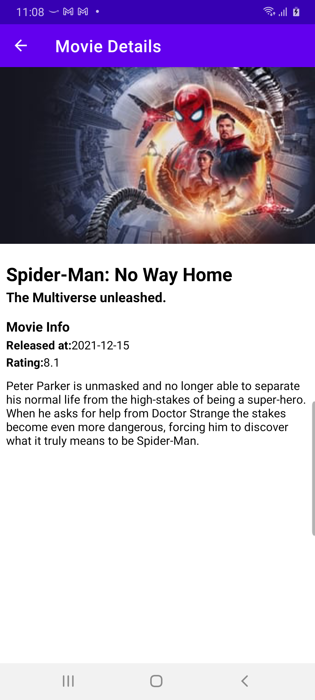

# clean-architecture-android
A Simple Android Mobile Application which has been implemented using MVVM Clean Architecture.

## Tech Stack

- Clean Architecture
- MVVM Pattern
- Kotlin
- Coroutines, Flow 
- LiveData
- Dagger Hilt
- Retrofit2
- Navigation Architecture Component

## Screenshots

## API Key 🔑

You will need to provide developer key to fetch the data from TMDB API.

- Generate a new key (v3 auth) from https://www.themoviedb.org/settings/api. 
- Copy the key and put it in local.properties file with key TMDB_API_KEY.
